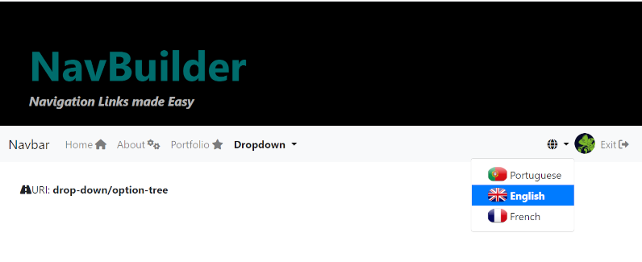
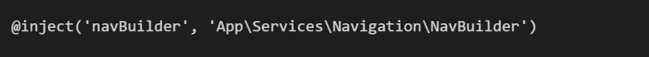
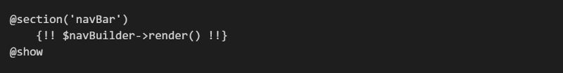
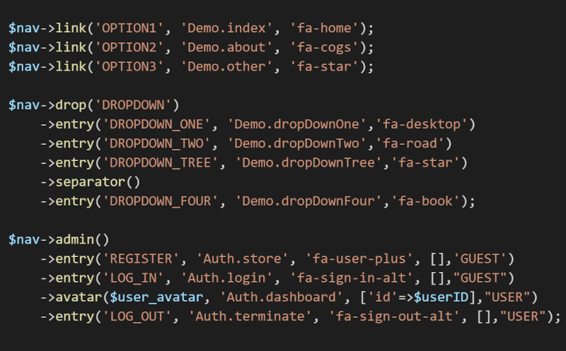
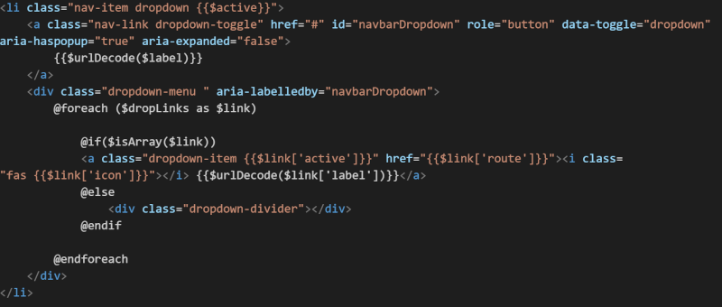
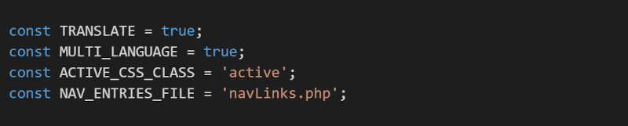

###To Run the demo:
- composer install (PHP Dependencies)
- npm i  (node dependencies)
- npm mix (build assets)
- npm run serve (Start php server with artisan)

Laravel Navigation Links Made Easy   Maintain your navigation links in a clear way.  Build your templates one time and use them for the  lifetime of your app.
 
In the demo you can find templates for: 
- bootstrap 
- bulma
- materialize.

To Use, copy the folder App/Services/Navigation in your project App/Services,  if you don't have one just create it. It's not a default Laravel folder
 
 
Inject the service on you blade view, on the master blade view if you are using a layout. 
 

 
And render your navigation bar 

Define your navigation Links, on file located at /routes with a default name of navLinks.php,  using 3 parameters;
- A Label, that can be showed as is or translated according to the App Locale.
- An url or named route. (Naming routes is always a good principle)
- Optionally an Icon from fontawesome

 
All popular CSS Frameworks like Bootstrap, Bulma or Materialize css have nav bar components,  
basically  links and dropdowns, that can be templated  and reused. Making a template is  
straightforward process. Below is the blade template for the bootstrap dropdown. 

- includes.php 

